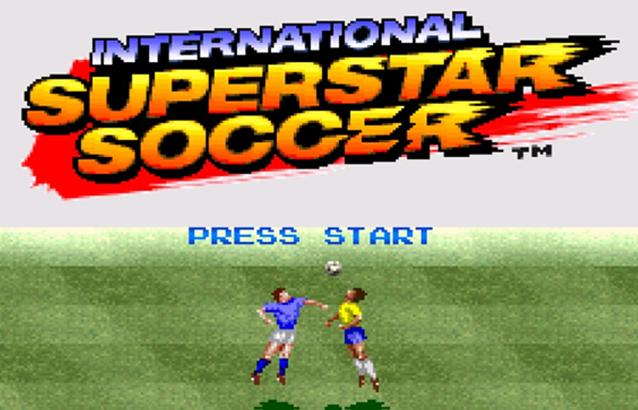

# Web ISS Studio (WIP 🚧)

 

Web ISS Studio is a Graphical Web User Interface to create your own game based on International Superstar Soccer for Super Nintendo Entertainment System (SNES).

## ✨ Features

You can edit:

- Players (name, shirt number, hair and skin color, normal or special, hairstyle)
- Hair and skin colors (normal players, special players and goalkeepers)
- Team names (positional text and tile images under the flag)
- Flag (design and colors)
- Uniform (kit) colors (for outfield players, first and second kits, and goalkeepers)

## 📝 Notes
- Works well with original ROM International Superstar Soccer (Europe), and ROMs based on it.
- When you save the design of a flag or a team name tile based image, team name tiled images are moved to the address 0x17680, so that you will have additional space to create more flags than the original game (from 0x48000 to 0x48A7F)

**Addresses used by editor** (you will recieve an error in order to protect your ROM if data overtake these addresses)

0x48000 to 0x48A7F - Flag design tile images
0x17680 to 0x17FFF - Team name tile images (automatically moved to this address)
0x43ED5 to 0x44486 - Team name positional text data

## 👨🏻‍🏫 Instructions
- Download a compatible SNES ROM of [`International Super Star Soccer`](https://wowroms.com/es/roms/super-nintendo/international-superstar-soccer-europe/27942.html) 
- Enter to [**Web ISS Studio**](https://estebanfuentealba.github.io/web-iss-studio/)
- Open ROM
- Edit ROM

## 📋 TODO
- [X] Read Team
    - [x] Read Teams Names
    - [x] Read Team Flags
    - [x] Read Team Colors
- [ ] Read Team Players
    - [x] Read Player Names
    - [x] Read Player Number
    - [x] Read Player Hair
    - [x] Read Player Color
    - [ ] Read Player Abilities
- [ ] Write Team
    - [ ] Read Teams Names
    - [ ] Read Team Flags
    - [ ] Read Team Colors
- [ ] Write Team Players
    - [ ] Write Player Names
    - [ ] Write Player Number
    - [ ] Write Player Hair
    - [ ] Write Player Color
    - [ ] Write Player Abilities
- [x] Navigate between teams
- [ ] Edit Initial Image
- [ ] Edit Sounds
- [ ] Edit GoalKeeper colors
## 🤖 Technologies
- ⚡️ Vite
- Vue3
- WASM
- C++

## 👍 Acknowledgements
-  [**Rodrigo Mallmann Guerra**](https://github.com/rodmguerra) This is a web version of [`ISS Studio`](https://github.com/rodmguerra/issparser) the editor created in Java by Rodrigo
- [**Vladimir Protopopov**](https://github.com/ProtonNoir) creador de [`KONAMI SNES COMPRESSOR`](https://github.com/ProtonNoir/SNES-decompression-tools/blob/master/Konami/konami_c.cpp) and [`KONAMI SNES DECOMPRESSOR`](https://github.com/ProtonNoir/SNES-decompression-tools/blob/master/Konami/konami_d.cpp)
