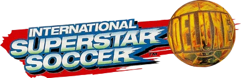

# ⚽ Web ISSD Studio (WIP 🚧)

<p align="center">
  
</p>

**Web ISSD Studio** is an open-source, browser-based ROM editor for **International Superstar Soccer Deluxe (ISSD)** on the Super Nintendo Entertainment System (SNES).

Customize national teams, players, uniforms, flags, graphics, sound effects, and other game assets through an intuitive graphical interface.

The project also maintains compatibility with the original **International Superstar Soccer (ISS)**.

🎮 **[Open Web ISSD Studio](https://estebanfuentealba.github.io/web-iss-studio/)**

---

## ✨ Features

### 🎮 Supported Games

| Game | Region | Teams | Players per Team |
|---|---|---|---|
| International Superstar Soccer | USA | 27 | 15 |
| International Superstar Soccer Deluxe | USA | 36 | 20 |

- Automatic ROM version detection.
- Support for `.sfc` and `.smc` files.
- Support for ROMs with or without a 512-byte SMC header.
- Original ROM data is preserved until export.
- ROM processing directly in the browser.
- Other regions and expanded ROM hacks are not currently supported.

The six hidden All-Star teams in ISS Deluxe are generated dynamically by the game and are not included in the 36 editable national teams.

## 👥 Team & Player Editor

Manage national teams and customize their players.

**Team editing**
- Edit team names and graphical name labels.
- View and edit national flags.
- Customize team colors and uniforms.
- Inspect original team formations.
- Navigate between all 36 national teams.

**Player editing**
- Edit player names (8-character game-compatible format).
- Modify shirt numbers while preserving unique identifiers.
- Change player positions.
- Select from 14 hairstyles.
- Customize normal and special skin colors.
- Edit player attributes and abilities.
- Preview hairstyles using original 32×32 pixel graphics.
- Preview skin colors using the game's original palettes.
- Filter and select multiple players.
- Apply player templates.
- Undo and redo modifications.

ISSD supports ten editable player attributes.

### ⚽ Team Formations

Inspect original formations, including player coordinates and roles.

The current formation diagram is a schematic representation of the game's data. Custom formation editing is planned for a future update.

## 🎨 Pixel Art Maker

The integrated **Pixel Art Maker** allows you to edit original SNES graphics directly in your browser.

Supported graphics include:

- National flags.
- Team name labels.
- Main menu logo.
- Player and goalkeeper sprites.
- Uniform details (shirts and shorts).
- Hairstyles.
- Player numbers.
- Soccer ball graphics.

### 🖼️ Import Images as Pixel Art

Import your own images and convert them into SNES-compatible pixel art.

- Supports PNG, JPG, WebP, GIF and BMP.
- Automatic image cropping and resizing.
- Color quantization.
- Palette extraction from uploaded images.
- Option to preserve the original palette.
- Preview before applying modifications.
- Horizontal and vertical flipping.
- Restore original graphics.

**Flag editor**

The flag editor converts imported images to **24×16 pixels**, using up to four colors. Each flag can be edited independently.

**Team labels**

Team name labels use a compact **32×8 pixel** format. The original red label style is preserved.

**Player graphics**

Edit player and goalkeeper graphics using the original ROM tiles and palettes. The dedicated uniform-detail editor currently modifies the front-facing chest tile; additional poses are planned.

**Main menu logo**

The logo editor reconstructs graphics using original tiles, tilemaps and palettes. Some pixels are shared between graphic elements, so editing follows the original palette and tile constraints.

Compressed graphics must fit within the available ROM storage space.

## 👕 Uniform & Color Editor

Customize team appearance using original SNES BGR555 palettes.

- Home and away uniforms.
- Goalkeeper colors.
- Player skin tones.
- Normal and special player palettes.
- Hair colors.
- Flag palettes.
- Shared color resources.

The editor identifies shared palettes and indicates when a modification may affect multiple teams or players.

## 🔊 Audio Editor

ISSD Studio can inspect, preview, export and partially replace the game's original audio samples.

**Audio inspection**
- Load all 76 original BRR samples.
- Preview audio directly in the browser.
- Display waveforms.
- Inspect DSP pitch information.
- Export decoded samples as WAV.
- Adjust playback preview frequency (8, 16 or 32 kHz).

**Audio replacement**
- Import WAV files.
- Support 8-bit and 16-bit PCM.
- Support mono and stereo input.
- Convert WAV audio into SNES-compatible BRR.
- Preview converted samples before applying.
- Replace 69 of the 76 original samples within their fixed storage allocations.

**Current limitations**

- Certain looped or fragmented samples cannot be replaced safely.
- The exact playback frequency of every sound event has not been verified.
- The 12 kHz inspection reference does not represent a verified playback frequency for every sample.
- Preview playback does not fully emulate the SNES DSP, including envelopes, echo and pitch behavior.
- Sequenced background music editing requires additional SPC700/DSP support.

## 💾 Project Management & ROM Export

Work on your ROM without permanently modifying the original file.

- Automatic project saving with IndexedDB.
- Project identification using SHA-256.
- Original ROM kept immutable.
- Resource-level modification tracking.
- Export and import projects as JSON.
- Restore original resources.
- Export modified ROM files.
- Binary validation before export.
- SNES checksum recalculation.
- Preserve original ROM size and SMC header.

Exporting a project without modifications produces a ROM identical to the original input.

**Important:** Modified ROM exports and graphic relocation still require validation in a SNES emulator or on original hardware.

---

## 🚀 Getting Started

### Online Editor

1. Open [Web ISSD Studio](https://estebanfuentealba.github.io/web-iss-studio/).
2. Select a compatible ISS or ISS Deluxe USA ROM from your own collection.
3. Wait for automatic ROM detection and asset loading.
4. Select a team, player, graphic or audio resource.
5. Edit your game.
6. Export the modified ROM.

ROM files are not included or distributed with this project.

### Local Development

**Requirements**
- Node.js and npm.
- A modern web browser.
- Emscripten SDK for rebuilding the optional WebAssembly module.

Clone the repository and install dependencies:

```bash
git clone https://github.com/EstebanFuentealba/web-iss-studio.git
cd web-iss-studio
npm ci
```

Start the development server:

```bash
npm run dev
```

Run tests:

```bash
npm test
```

Build for production:

```bash
npm run build
```

Build the WebAssembly module when required:

```bash
npm run build-wasm
```

The ROM reader works directly in the browser without requiring WebAssembly. The C++ compressor and supporting code are retained for graphics processing and future editing functionality.

### Testing with Original ROMs

Place your privately obtained compatible ROM files in the `roms/` directory to enable additional validation.

Tests cover ROM parsing, team data, player information, graphics, audio samples and editing operations.

Synthetic test vectors are used when original ROM files are unavailable.

---

## 📋 Development Status

| Feature | Status |
|---|---|
| ISS USA ROM detection and reading | ✅ Implemented |
| ISS Deluxe USA ROM detection and reading | ✅ Implemented |
| Team and player data reading | ✅ Implemented |
| Player names, numbers and positions | ✅ Implemented |
| Player attributes, hairstyles and skin colors | ✅ Implemented |
| Team and uniform palette editing | ✅ Implemented |
| Flag Pixel Art Maker | ✅ Implemented |
| Team name graphics editor | ✅ Implemented |
| Player and goalkeeper graphics editor | ✅ Partial |
| Main menu logo editor | ✅ Partial |
| Image import and pixel art conversion | ✅ Implemented |
| Original team formation viewer | ✅ Implemented |
| Custom formation editing | ⏳ Planned |
| Audio BRR reading and WAV export | ✅ Implemented |
| WAV import and BRR replacement | ✅ Partial |
| Sequenced music editing | ⏳ Planned |
| IndexedDB autosave | ✅ Implemented |
| JSON project import/export | ✅ Implemented |
| Modified ROM export | ✅ Implemented |
| Add, remove or reorder teams | ⏳ Research |
| Main menu player photographs | ⏳ Planned |
| Team photographs | ⏳ Planned |
| Emulator and hardware validation | ⏳ Pending |

### Known Limitations

- The number of teams is currently fixed at 36 for ISS Deluxe USA.
- Adding, deleting or reordering teams requires additional reverse engineering of executable code and references.
- Main menu player photographs and team photographs are not yet editable.
- Some compressed graphics have strict size limitations.
- Shared graphic resources may affect multiple elements.
- Custom team formations are not yet supported.
- Complete SNES DSP audio emulation is not implemented.
- Modified ROMs have not yet completed emulator validation.

See [ISSD-Editor-Plan.md](ISSD-Editor-Plan.md) for the implementation roadmap and remaining tasks.

---

## 🔧 Technical Details

### ROM Formats

The editor currently targets verified USA LoROM versions of International Superstar Soccer and International Superstar Soccer Deluxe.

Supported file extensions:

- `.sfc`
- `.smc`

ROM files with a 512-byte copier header are supported.

### Graphics and Compression

The editor uses original SNES tile graphics and palette data. Certain graphics are compressed using Konami's proprietary game-specific compression format.

Graphics editing and relocation must preserve the ROM's internal pointers and resource boundaries.

### ROM Addresses

The following address ranges are associated with the original ISS graphics editor implementation.

| Address range | Description |
|---|---|
| `0x48000–0x48A7F` | Flag graphic tiles |
| `0x17680–0x17FFF` | Relocated team name graphic tiles |
| `0x43ED5–0x44486` | Team name positional text |

These legacy address ranges must not be assumed valid for every ISS Deluxe resource. The editor uses game-specific profiles and verified offsets.

The flag relocation logic preserves all 42 graphics slots, including hidden teams, and both original flag-loading routines. Emulator validation is still pending.

### Research & Documentation

- [ISSD-SNES-ROM-Web-Editor](https://github.com/EstebanFuentealba/ISSD-SNES-ROM-Web-Editor)
- [issd-native](https://github.com/sergiomanzur/issd-native)
- [ISSD-PLAN.md](ISSD-PLAN.md)
- [ISSD-Editor-Plan.md](ISSD-Editor-Plan.md)

Relevant reverse-engineering references from `issd-native` include:

- `ISSDNative/issd_mod_rom.c`
- `issd_decompress.c`
- DSP audio decoder
- `deps/ISSD-disassembly/International_Superstar_Soccer_Deluxe/AsarScripts/AssetPointersAndFiles.asm`

---

## 🤖 Technologies

- **Vue 3** — Web user interface.
- **Vite** — Development and production builds.
- **JavaScript** — ROM parsing, asset editing and browser integration.
- **C++** — Native graphics processing and compression utilities.
- **WebAssembly (WASM)** — Browser integration for native components.
- **IndexedDB** — Local project persistence.
- **HTML Canvas** — Pixel art editing and graphics previews.
- **Web Audio API** — Audio inspection and playback.

## ⚖️ Legal Notice

Web ISSD Studio is an independent, fan-made project and is not affiliated with or endorsed by Konami or Nintendo.

International Superstar Soccer and International Superstar Soccer Deluxe are trademarks or intellectual property of their respective owners.

This repository does not include copyrighted game ROMs, original game audio files or distributed commercial game assets.

Users are responsible for obtaining and using ROM files in accordance with applicable laws.

## 👍 Acknowledgements

Special thanks to the developers and researchers whose work helped make this project possible.

**[Rodrigo Mallmann Guerra](https://github.com/rodmguerra)**

Creator of [ISS Studio](https://github.com/rodmguerra/issparser), the original Java-based ISS editor that inspired this web project.

**[Vladimir Protopopov](https://github.com/ProtonNoir)**

Creator of the [Konami SNES Compressor](https://github.com/ProtonNoir/SNES-decompression-tools/blob/master/Konami/konami_c.cpp) and [Konami SNES Decompressor](https://github.com/ProtonNoir/SNES-decompression-tools/blob/master/Konami/konami_d.cpp).

**[sergiomanzur](https://github.com/sergiomanzur/issd-native)**

For the ISS Deluxe native editing tools, decompression research, audio decoding and ROM structure references.

---

**⚽ Web ISSD Studio — Bring your own version of International Superstar Soccer Deluxe to life!**