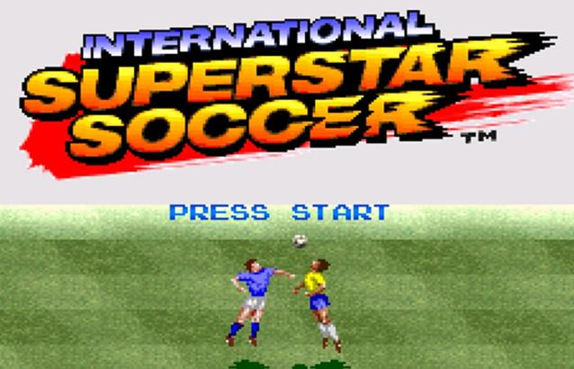

# Web ISS/ISSD Studio (WIP 🚧)
<p align='center'>
<br />
</p>

Web ISS Studio is a Graphical Web User Interface to create your own game based on International Superstar Soccer for Super Nintendo Entertainment System (SNES).

## Lectura de ISS y ISS Deluxe USA

La interfaz detecta automáticamente `International Superstar Soccer (USA)` (27 equipos, 15 jugadores por equipo) y `International Superstar Soccer Deluxe (USA)` (36 equipos nacionales, 20 jugadores por equipo). Acepta `.sfc` y `.smc` con o sin cabecera de 512 bytes. Lee nombres, dorsales, pelo y banderas; Deluxe incluye piel, posición y diez atributos. En la tabla Deluxe, Pelo muestra una previsualización de cabeza de 32×32 px construida con tiles de la ROM, y Piel muestra un cuadrado de 20×20 px con el tono de la paleta normal o especial del equipo. Las banderas y rótulos se extraen del archivo abierto, con paletas originales para las banderas y una paleta de previsualización para los rótulos Deluxe.

En Deluxe, la sección Audio permite cargar 76 voces/muestras BRR, reproducirlas y descargarlas como WAV. La frecuencia 8/16/32 kHz ajusta la velocidad de previsualización (8 kHz por defecto); no reproduce el pitch, envolventes o eco del DSP original. La música secuenciada necesitaría un motor SPC700/DSP. Los seis equipos estrella, que ensamblan sus plantillas durante el juego, quedan fuera de la lista de equipos nacionales.

```sh
npm ci
npm run dev
npm test
npm run build
```

Las pruebas incluyen vectores sintéticos y, si las ROMs están en `roms/`, validan todos los equipos y muestras de ambos archivos. Las ROMs no se incluyen ni se distribuyen. El lector funciona en el navegador sin cargar WASM; el código C++ y su compresor se conservan para futuras tareas de edición.

Investigación: [ISSD-SNES-ROM-Web-Editor](https://github.com/EstebanFuentealba/ISSD-SNES-ROM-Web-Editor), y [issd-native](https://github.com/sergiomanzur/issd-native), especialmente `ISSDNative/issd_mod_rom.c`, `issd_decompress.c`, el decodificador DSP y `deps/ISSD-disassembly/International_Superstar_Soccer_Deluxe/AsarScripts/AssetPointersAndFiles.asm`. El plan y los offsets comprobados están en [ISSD-PLAN.md](ISSD-PLAN.md).

## ✨ Features

You can edit:

- Players (name, shirt number, hair and skin color, normal or special, hairstyle)
- Hair and skin colors (normal players, special players and goalkeepers)
- Team names (positional text and tile images under the flag)
- Flag (design and colors)
- Uniform (kit) colors (for outfield players, first and second kits, and goalkeepers)

## 📝 Notes
- The current reader validates the USA LoROM versions listed above. Other regions and expanded hacks require their own verified profile.
- When you save the design of a flag or a team name tile based image, team name tiled images are moved to the address 0x17680, so that you will have additional space to create more flags than the original game (from 0x48000 to 0x48A7F)

**Addresses used by editor** (you will recieve an error in order to protect your ROM if data overtake these addresses)

0x48000 to 0x48A7F - Flag design tile images
0x17680 to 0x17FFF - Team name tile images (automatically moved to this address)
0x43ED5 to 0x44486 - Team name positional text data

## Editor ISS Deluxe USA

Al abrir ISS Deluxe USA aparece el editor con secciones de jugadores, apariencia, gráficos, audio y proyecto. El lector de ISS USA se conserva.

- Jugadores: nombres de 8 caracteres compatibles, dorsal/identificador con intercambio para conservar unicidad, posición, 14 estilos de pelo, piel y estadísticas; filtros, selección múltiple, plantillas y undo/redo.
- Equipos: edición gráfica del rótulo y copia de las formaciones originales, incluyendo coordenadas y roles. El diagrama es una vista esquemática.
- Apariencia: paletas BGR555 local/visitante, portero, bandera y piel/pelo alternativos. Los cambios compartidos indican a qué equipos afectan.
- Pixel Art Maker: banderas completas e independientes, rótulos, detalle de camiseta sobre el jugador, sprites completos de jugador/portero, números, balón, pelos y logo de portada armado con sus colores reales; herramientas de dibujo, PNG con recorte/cuantización, flips y restauración. Los bloques comprimidos deben caber en su espacio original.
- Audio: waveform y pitch DSP de **inspección** continuo. Importar WAV PCM mono/estéreo 8/16 bits, convertir a BRR y previsualizar antes de aplicar. 69 de las 76 muestras originales admiten reemplazo fijo; loops y recursos fragmentados se rechazan. **La velocidad exacta por evento todavía está pendiente**; 12000 Hz iniciales son una referencia de inspección, no una frecuencia verificada para todo el juego.
- Autoguardado IndexedDB por SHA-256, original inmutable, cambios por recurso, proyecto JSON importable/exportable y restauración.
- Exportar ROM aplica cambios binarios, valida recursos y checksum, conserva cabecera SMC y tamaño. Sin cambios produce el archivo original idéntico.

No se implementa aumento/eliminación/reordenamiento de los 36 equipos: depende de código ejecutable y referencias aún no resueltas. Fotos de portada/equipo y formaciones personalizadas siguen pendientes. El logo conserva los mapas y tiles del juego; algunos píxeles se reutilizan y la edición respeta las paletas de cada capa. La vista frontal de detalles de camiseta edita su tile del pecho; otras poses aún no tienen vista dedicada. La ROM editada aún no se ha probado en emulador.

El estado y todas las tareas pendientes están en [ISSD-Editor-Plan.md](ISSD-Editor-Plan.md). `npm test` ejecuta pruebas del lector y editor; las pruebas de ROM real requieren los archivos privados en `roms/` (no se incluyen).

## 👨🏻‍🏫 Instructions
- Download a compatible SNES ROM of [`International Super Star Soccer`](https://wowroms.com/es/roms/super-nintendo/international-superstar-soccer-europe/27942.html) 
- Enter to [**Web ISS Studio**](https://estebanfuentealba.github.io/web-iss-studio/)
- Open ROM
- Edit ROM

## 📋 TODO
- [X] Read Team
    - [x] Read Teams Names
    - [x] Read Team Flags
    - [x] Read Team Colors
- [ ] Read Team Players
    - [x] Read Player Names
    - [x] Read Player Number
    - [x] Read Player Hair
    - [x] Read Player Color
    - [ ] Read Player Abilities
- [ ] Write Team
    - [ ] Write Teams Names
    - [ ] Write Team Flags (Editor)
    - [ ] Write Team Colors
- [ ] Write Team Players
    - [ ] Write Player Names
    - [ ] Write Player Number
    - [ ] Write Player Hair
    - [ ] Write Player Color
    - [ ] Write Player Abilities
- [x] Navigate between teams
- [ ] Edit Initial Image
- [ ] Edit Sounds
- [ ] Edit GoalKeeper colors
## 🤖 Technologies
- ⚡️ Vite
- Vue3
- WASM
- C++

## 👍 Acknowledgements
-  [**Rodrigo Mallmann Guerra**](https://github.com/rodmguerra) This is a web version of [`ISS Studio`](https://github.com/rodmguerra/issparser) the editor created in Java by Rodrigo
- [**Vladimir Protopopov**](https://github.com/ProtonNoir) creador de [`KONAMI SNES COMPRESSOR`](https://github.com/ProtonNoir/SNES-decompression-tools/blob/master/Konami/konami_c.cpp) and [`KONAMI SNES DECOMPRESSOR`](https://github.com/ProtonNoir/SNES-decompression-tools/blob/master/Konami/konami_d.cpp)


El editor de banderas permite **Subir imagen y convertir a pixel art**: recorta y ajusta PNG/JPG/WebP/GIF/BMP a 24×16 y a una paleta nueva extraída de la imagen (hasta cuatro colores, con opción de conservar la paleta actual), muestra el resultado y permite aplicarlo a la ROM de forma independiente. El nombre de equipo usa letras compactas para el rótulo32×8 y conserva el rótulo rojo. Los cambios de dibujo actualizan Edición y, después de aplicarlos, permiten exportar sin una previsualización pendiente. La reubicación conserva los42slots de gráficos (incluidos equipos ocultos) y ambos cargadores de banderas; sigue pendiente validación en emulador.
